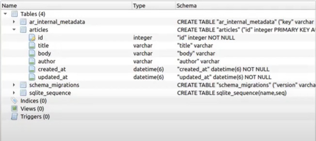

# README

This README would normally document whatever steps are necessary to get the
application up and running.

Things you may want to cover:

* Ruby version

* System dependencies

* Configuration

* Database creation

* Database initialization

* How to run the test suite

* Services (job queues, cache servers, search engines, etc.)

* Deployment instructions

* ...


# Creating a simple CRUD using RoR

first of all you need to take care about the settings to run a RoR project in your machine. 

Where you can find this?

You can go to: 

[Getting Started](https://guides.rubyonrails.org/v5.0/getting_started.html)

[Ruby Installer](https://rubyinstaller.org/downloads/)


After you installed everything

run these commands:

## Setup the project

Check if you have rails installed
```
rails --version
```

This is a RoR template that creates simple project for CRUD
```
rails new backend --api
```


```
cd backend
```

Create a folder inside the api folder called v1
```
rails generate controller api/v1/articles index show create update destroy --skip-helper --skip-assets --skip-template-engine --skip-test-framework
```

You'll see that you now have a file article in api folder, now let's set the model
```
rails g model article title:string body:string author:string --skip-helper --skip-assets --skip-template-engine --skip-test-framework
```

the g command above is the same as generate command, ok? 


Now focus on database
```
rake db:create
```

After you'll see that has 2 files on db folder, the development and the test, both with sqlite3 extension. After that we need to do something to apply our schema, it's MIGRATION

Migrations are a convenient way to alter your database schema over time in a consistent way, so we don't need to write SQL commands, it's allow the schema and changes to be database independent, and create a history for the changes in the database
```
rake db:migrate
```

The migrations are migrated, you will see that now have schema file, there you can check what you created.

<p align="center">
  
</p>

### Running the server
```
bin/rails server
```

### Testing API - CRUD

Created a function on the controller 

```
  private
  def arti_params
    params.require(:article).permit([
      :title,
      :body,
      :author
    ])
  end
```
This is the function to permit and the fields to access what we send from the api and the create function collects these data.

The create function:
```
  def create
    article = Article.new(
      title: arti_params[:title],
      body: arti_params[:body],
      author: arti_params[[:author]]
    )
    if article.save
      render json: article, status: 200
    else
      render json: {
        error: "Error creating..."
      }
    end
  end
```

We did the C, the CREATE. Now let's do the READ

To list all
```
  def index
    articles = Article.all
    render json: articles, status: 200
  end
```

To list one specific
```

```

```
```

```
```

```
```

```
```


